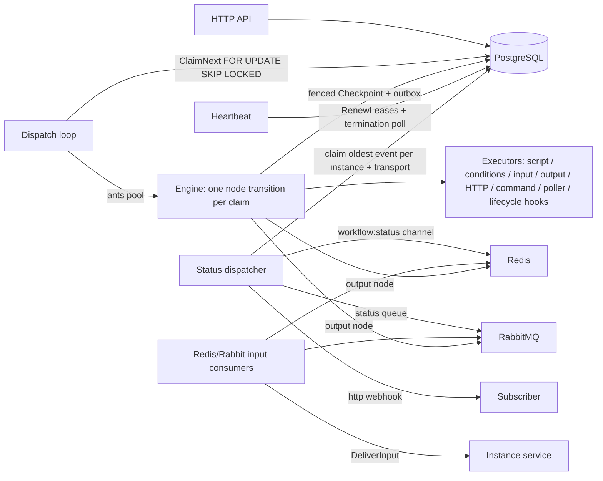

# SimpWF Architecture

SimpWF is a PostgreSQL-backed durable workflow engine: immutable definitions,
a leased state machine, HTTP input/control/debug APIs, and optional
Redis/RabbitMQ transports for broker input nodes, output nodes, and
multi-transport status notifications. A transactional outbox is the durable
internal queue for status notifications regardless of transport. This
document describes package boundaries, the runtime model, and the deployment
shape.

## Package boundaries and dependency direction

```
handler ──> service ──> engine ──> executor ─┐
   │            │          │                 │
   │            │          └─> repository ──>├──> model ──> pkg/*
   │            └─> repository ─────────────>│
   └─> model ───────────────────────────────>┘

inputtransport ──> service / transport
executor ──> transport (narrow publish and poller interfaces)
statusupdate ──> transport (narrow publish interfaces)
cmd/app ──> transport (clients), inputtransport, statusupdate
```

Allowed direction is `handler -> service -> engine/repository/model`,
`engine -> executor/repository/model`, and
`repository/executor -> model/pkg`. `cmd/app` may wire all packages. Lower
levels never import handlers or services. PostgreSQL state, leases, and
polling are the durable dispatch mechanism; brokers are optional add-ons
behind narrow interfaces.

| Package                          | Responsibility                                                                                                                                                                                                                                                                                                                                                                                                                                                                                                                                                            |
| -------------------------------- | ------------------------------------------------------------------------------------------------------------------------------------------------------------------------------------------------------------------------------------------------------------------------------------------------------------------------------------------------------------------------------------------------------------------------------------------------------------------------------------------------------------------------------------------------------------------------- |
| `cmd/app`                          | Composition root: configuration, database, system-user seed, repositories, services, executors, engine, ants dispatcher, optional broker clients/consumers, status publishers, Gin router, graceful shutdown. No workflow rules.                                                                                                                                                                                                                                                                                                                                          |
| `cmd/atlas-loader`                 | Atlas Go Program Mode schema loader; never runs AutoMigrate.                                                                                                                                                                                                                                                                                                                                                                                                                                                                                                              |
| `internal/workflow/model`          | Framework-free domain: entities, statuses, `Frame`/`Counters`/`Limits`, transition invariants, workflow/group-scoped condition-key routing, node-content validation (input channels `http`, `redis`, `rabbitmq`; output nodes; poller transports `http`, `redis`, `rabbitmq` with per-transport defaults; multi-transport `status_update`).                                                                                                                                                                                                                                                   |
| `internal/workflow/repository`     | GORM persistence: models, mappers, fenced claims (`FOR UPDATE SKIP LOCKED`), checkpoints (lease + revision), pause/resume/stop, node attempts, events, idempotent input deliveries, termination pending/sweep, status-update outbox (atomic per-transport fan-out enqueue + ordered claim/deliver/dead-letter).                                                                                                                                                                                                                                                             |
| `internal/workflow/executor`       | Node executors: Goja sandbox (cloned/frozen context, no eval, hard timeout, ctx-cancellation interrupt), script, conditions, input validation, outbound HTTP (allowlist + DNS + redirect revalidation), allowlisted commands (argv only, process-group kill), output (publish resolved context value, receipt), active pollers (repeated HTTP, Redis GET/SUB, RabbitMQ queue waits; frozen `until` predicate over a normalized response), lifecycle hooks (shared `HookRunner`: pre/post context-transform scripts in the same sandbox, frozen `output` global for post hooks). |
| `internal/workflow/engine`         | Durable cursor machine (`EnterGroup`/`Advance`), one transition per claim, recovery, per-node/total limits, cancellation registry, fenced commit, lease fencing; ants-based dispatcher with claim/heartbeat loops and termination polling. Node transitions run optional lifecycle hooks: pre before node behavior, post after the output merge, exited-group posts innermost-first.                                                                                                                                                                                          |
| `internal/workflow/transport`      | Optional Redis and RabbitMQ adapters: connect/ping, durable queue declaration, confirmed persistent publishing, pattern/exact subscribe, keyed GET with missing-key detection, manual-ack consume including per-execution arbitrary-queue poller consumption, clean shutdown; narrow `RedisPublisher`/`RabbitPublisher` interfaces plus poller `Get`/`Subscribe`/`ConsumeQueue` surfaces.                                                                                                                                                                                           |
| `internal/workflow/inputtransport` | Broker input consumers: Redis pattern subscriber (`workflow:input:*`, envelope decode) and RabbitMQ queue consumer (`NodeInstanceId` + `IdempotencyKey` headers, `message_id` fallback, manual ack/requeue), both delivering through `InstanceService.DeliverInput` with the matching source channel.                                                                                                                                                                                                                                                                               |
| `internal/workflow/statusupdate`   | Status-notification dispatcher: claims the oldest unresolved outbox event per instance/transport, loads the immutable per-definition config, publishes through the transport's publisher (http/redis/rabbitmq), retries with the transport's `retry_delay` and dead-letters past its `max_retry`.                                                                                                                                                                                                                                                                             |
| `internal/workflow/service`        | Use-case orchestration: definitions, instance create/status/context/input (source channel must match the input node channel), node debug, pause/resume/stop controls (events + local cancellation signal). Accepted input deliveries run the input node's post hook and any enclosing group post hooks; a failing post hook fails the workflow atomically with the delivery.                                                                                                                                                                                              |
| `internal/workflow/handler`        | Gin routes, HTTP DTOs, query parsing, RFC 7807 problem+json.                                                                                                                                                                                                                                                                                                                                                                                                                                                                                                              |
| `pkg/*`                            | Configuration (Viper), database (pgx), UUIDv7 ids, context paths + typed rendering, host-function registry. No `internal` imports.                                                                                                                                                                                                                                                                                                                                                                                                                                          |
| `migrations/`                      | Atlas config + immutable versioned SQL + `atlas.sum`.                                                                                                                                                                                                                                                                                                                                                                                                                                                                                                                       |

## Runtime model



- **Claim**: a dispatcher claims runnable instances with
  `SELECT ... FOR UPDATE SKIP LOCKED`, sets status `running`, and leases them
  to its worker with an expiry. Each claim executes exactly one node
  transition, then checkpoints the new cursor (status `waiting`/`paused`/
  `finished`/`failed`).
- **Checkpoint fencing**: `UPDATE ... WHERE id = ? AND revision = ? AND
  leased_by = ?`. A stale worker gets `ErrLeaseLost` and aborts silently —
  a stop or another writer always wins.
- **Heartbeat**: the dispatcher renews its leases and polls
  `termination_pending` instances, cancelling them through the engine's
  cancellation registry (cross-replica stop propagation).
- **Recovery**: when a lease expires, the next claim finds the running
  attempt. Scripts requeue (new attempt); input nodes re-enter waiting;
  `external_call` requeues only with `retry_on_recovery=true`, otherwise the
  node and workflow fail. `poller` behaves like `external_call` but defaults
  `retry_on_recovery` to `true`, so an interrupted poller restarts with a
  fresh internal attempt/wait budget (in-loop attempt counts are not
  persisted).
- **Instance audit**: starting an instance stamps `created_by` and
  `updated_by` with the configured system actor (no auth yet); the status
  and list APIs return both fields. The instance list endpoint returns
  compact summaries (never the full context/frame/counters/lease state)
  with repeated `id`, one `workflow_definition_id`, and repeated `status`
  filters, paginated with the same envelope as the definition lists.
- **Status notifications**: each externally meaningful status transition
  (waiting for input, input received, paused, resumed, finished, failed,
  stopped) is enqueued into `status_update_outbox` in the same transaction
  as the transition, when the definition configures any `status_update`
  transport (http, redis, rabbitmq, or any combination). Each event fans out
  to one row per configured transport, all sharing one logical event id.
  Scheduler `waiting <-> running` churn and pending-pause flag changes are
  skipped. A dedicated dispatcher delivers events strictly in
  per-instance/per-transport order (`revision`, `event_index`), retrying
  with each transport's `retry_delay` and dead-lettering after its
  `max_retry` retries so later events unblock. Delivery is at-least-once;
  the shared logical event id doubles as an idempotency key for receivers.
- **Condition routing**: a conditions node requires at least two conditions;
  the executor evaluates all of them and exactly one must return true. Zero
  matches fail the workflow (`no condition matched`), and multiple matches
  fail it listing every matched index and key. The single match returns its
  optional key, and the engine resolves that key only against the containing
  scope. Missing/null/blank condition keys, and defined keys mapped to
  null/empty targets, exit the current scope. Key targets cannot cross group
  boundaries.
- **Lifecycle hooks**: every node type accepts optional `pre_script` and
  `post_script` context-transform hooks, run by the executor package's
  shared `HookRunner` in the same Goja sandbox as node scripts. A pre hook
  transforms the workflow context before the node's own behavior (including
  `input_data` resolution and template rendering); a post hook transforms it
  after the native output was merged, receiving that output as a frozen
  `output` global. Hook return values are ignored — hooks produce no output
  of their own. Group hooks wrap children: the pre hook runs before the
  first child, and exited groups' post hooks run innermost-first. A failing
  hook fails the node and the workflow (`pre-script`/`post-script` errors);
  a failing structural group hook fails the workflow while preserving the
  latest completed context, because groups have no node attempt. For `input`
  nodes the pre hook is checkpointed once before parking and the post hook
  runs once per accepted delivery (rejected deliveries run neither); an
  accepted delivery whose post hook fails still returns 202 but fails the
  workflow atomically with the merged payload context. Reusable node
  definitions supply hook defaults; occurrences inherit, override, or
  disable (explicit `null`) each hook independently.
- **Failure routing**: `external_call` and `poller` nodes may configure
  `on_failure` (`next_node` and `output_property`). When an executor fails
  (or HTTP status `>= 300` on external calls, or recovery with
  `retry_on_recovery=false`), the node attempt is marked `failed`, its
  `post_script` is skipped, a structured failure payload `{message, reason, result}`
  is written to `output_property` in context, and the frame advances to the
  fallback node. The engine emits `node_failed` and `node_failure_routed`
  without emitting `workflow_failed`, checkpointing the instance as runnable
  or paused with no workflow error.
- **Cancellation**: every transition runs on a per-instance cancellable
  context registered in the engine. `Cancel` interrupts Goja (runtime
  interrupt), aborts HTTP (request context), SIGKILLs command process
  groups, and aborts active poller waits (in-flight request, inter-attempt
  delay, Redis subscription, RabbitMQ consumption). Interrupted attempts
  become `stopped` + `cancelled` when a stop committed; otherwise they are
  left running for another worker to recover.

## State machines

```
[*] --> waiting: create
waiting --> running: claim
running --> waiting: checkpoint (continue)
running --> paused: deferred pause after node
waiting --> paused: pause (immediate)
paused --> waiting: resume
waiting --> stopped: stop
running --> stopped: stop (fences worker, cancels node)
paused --> stopped: stop
running --> finished: no next node
running --> failed: node error / no condition matched / limits
```

Node statuses: `waiting -> running -> finished | failed | stopped`.

## Dispatcher lifecycle

1. `NewDispatcher` builds an ants pool and a cancellable run context.
2. `Run` starts the claim loop (poll `ClaimNext`, submit to the pool, inline
   fallback if the pool is closed) and the heartbeat loop (renew leases,
   poll termination-pending, sweep finished cleanups).
3. `Shutdown` cancels the loops, waits for in-flight transitions, releases
   the pool. In-flight executors are interrupted; interrupted attempts with
   no committed stop stay `running` for another worker to recover.

## Status-update dispatcher lifecycle

1. `NewDispatcher` builds an ants pool and a cancellable run context.
2. `Run` polls `ClaimNextStatusUpdates`, which returns only the oldest
   undelivered, non-dead event per workflow instance **and transport**
   (older siblings of the same transport block later events until delivered
   or dead; expired claims are reclaimed; transports never block each
   other).
3. Claimed events run through the pool: `deliver` loads the immutable
   definition config, routes the event to its transport's publisher, and
   resolves the outbox row — delivered on success, retried after the
   transport's `retry_delay`, or dead-lettered once attempts exceed the
   transport's `max_retry`.
4. `Shutdown` cancels the claim loop and waits for in-flight deliveries.

Transports are pluggable behind the `statusupdate.Publisher` interface,
routed by the outbox row's transport: HTTP reuses the engine
allowlist/DNS/redirect policy, Redis publishes to the instance's status
channel (best effort), and RabbitMQ publishes persistent, confirmed messages
to the configured status queue.

## Broker input

When a broker DSN is configured, `cmd/app` starts the matching consumer:

- **Redis**: pattern-subscribes `workflow:input:*`. Each envelope
  `{"idempotency_key": "...", "payload": <json>}` is delivered to the
  instance named by the channel suffix with source `redis`. Redis pub/sub is
  best effort: a successful publish counts as delivered even with zero
  subscribers, and a failed delivery is logged while consumption continues.
- **RabbitMQ**: consumes the configured input queue with manual
  acknowledgments. `NodeInstanceId` and `IdempotencyKey` headers address the
  delivery (AMQP `message_id` is the idempotency fallback). Permanent
  outcomes (success, validation rejection, domain conflicts) are
  acknowledged or rejected; transient repository failures are requeued with
  a bounded backoff.

Both consumers call `InstanceService.DeliverInput` with their source
channel; the service rejects a delivery whose source does not match the
channel of the input node the instance is parked on.

## Output nodes

An `output` node publishes the exact JSON of its selected `context_path` to
its channel (`redis` → `workflow:output:<instance_id>`, `rabbitmq` → the
configured `output_queue` with `NodeInstanceId`/`IdempotencyKey` headers and
the stable execution id as AMQP `message_id`). The publish result
(`{channel, destination, message_id}`) is written to the workflow context
through the normal `output_property` behavior. A broker-disabled deployment
or a publish error fails the node like any other execution error.

## Pollers

A `poller` node is an active wait executed by `PollerExecutor` through the
normal engine executor path, so every poller occupies one dispatcher worker
slot for its whole wait (a deliberate difference from parked `input` nodes;
worker-pool sizing and wait defaults are the operational capacity controls).
Exactly one transport block is required, and the `until` predicate (inside
that block) runs in the frozen sandbox against a normalized `response`
(`{body, headers?, status?}`, unavailable fields omitted, invalid JSON
bodies kept as strings) with the frozen workflow context. The first HTTP or
Redis GET call starts immediately, `delay` only separates attempts, and
every call counts toward `max_attempts`; Redis SUB and RabbitMQ wait up to
`max_wait_time`. `request_timeout`/`max_wait_time` are parsed without the
global node-timeout cap.

Broker pollers reuse the same `RedisClient`/`RabbitClient` connections as
input/output (no extra long-lived connections), behind the narrow
executor-side `RedisPollerClient` (`Get` with missing-key detection,
exact-channel `Subscribe`) and `RabbitPollerClient` (`ConsumeQueue`:
per-execution fresh AMQP channel, passive queue check of the
pre-provisioned queue, QoS 1, unique consumer tag, manual ACK settlement,
channel closed on return/cancellation — the fixed input consumer channel is
never reused). Poller templates additionally expose the reserved automatic
roots `workflow_instance_id` and `node_instance_id` (read-only, always win
over user values, never persisted).

Capacity and delivery semantics to design against:

- Redis pub/sub is broadcast and best-effort: several pollers can accept the
  same message, and messages published while no poller is subscribed are
  lost. Nonmatching messages are discarded.
- RabbitMQ polling assumes the queue is pre-provisioned and exclusive to one
  active poller execution. Every consumed message is ACKed: false messages
  are discarded, the first match completes the node, and
  predicate/normalization errors ACK then fail the node, so poison messages
  cannot requeue.
- Exhaustion (`max_attempts` or `max_wait_time`), rendering errors, missing
  broker transports, and missing/unconsumable RabbitMQ queues fail the node
  and the workflow. Interrupted pollers default to recovery retry with a
  fresh internal budget; in-loop attempt counts and elapsed waits are not
  persisted.

## Deployment shape

`docker-compose.yml` runs PostgreSQL 16, an Atlas `migrate` service (waits
for a healthy database, applies `migrations/versions`), Redis 7 and
RabbitMQ 4 (with management UI), and `app` (waits for the migration to
complete and both brokers to be healthy, then serves the API, dispatcher,
status dispatcher, and broker consumers). The app never migrates. Broker
DSNs are optional: without them the app runs HTTP-only. Horizontal scaling
is safe: multiple `app` replicas share the database; leases and SKIP LOCKED
prevent duplicate execution, the heartbeat propagates stops across replicas,
and per-transport outbox ordering keeps status delivery correct across
replicas.
