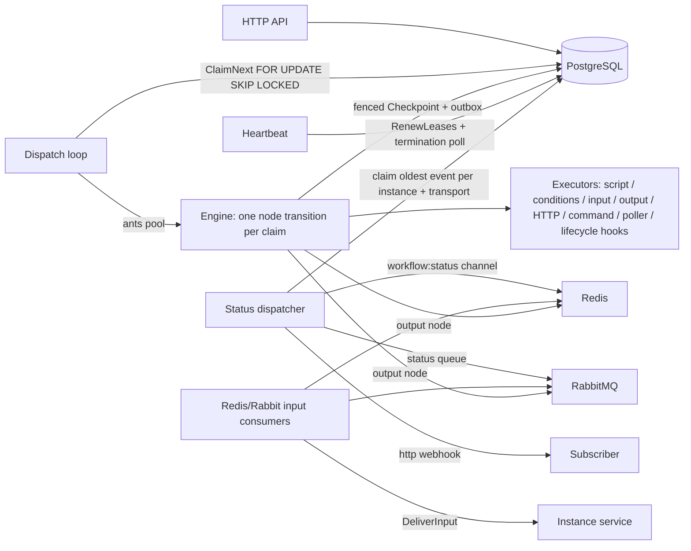

# SimpWF Architecture

SimpWF is a PostgreSQL-backed durable workflow engine: immutable definitions,
a leased state machine, HTTP input/control/debug APIs, and optional
Redis/RabbitMQ transports for broker input nodes, output nodes, and
multi-transport status notifications. A transactional outbox is the durable
internal queue for status notifications regardless of transport. This
document describes package boundaries, the runtime model, and the deployment
shape.

## Package boundaries and dependency direction

```
handler ──> service ──> engine ──> executor ─┐
   │            │          │                 │
   │            │          └─> repository ──>├──> model ──> pkg/*
   │            └─> repository ─────────────>│
   └──> auth ───────────────────────────────┘

inputtransport ──> service / transport
executor ──> transport (narrow publish and poller interfaces)
statusupdate ──> transport (narrow publish interfaces)
cmd/app ──> transport (clients), inputtransport, statusupdate
```

Allowed direction is `handler -> service -> engine/repository/model`,
`engine -> executor/repository/model`, and
`repository/executor -> model/pkg`. `cmd/app` may wire all packages. Lower
levels never import handlers or services. PostgreSQL state, leases, and
polling are the durable dispatch mechanism; brokers are optional add-ons
behind narrow interfaces.

| Package                          | Responsibility                                                                                                                                                                                                                                                                                                                                                                                                                                                                                                                                                                                                                                                                   |
| -------------------------------- | -------------------------------------------------------------------------------------------------------------------------------------------------------------------------------------------------------------------------------------------------------------------------------------------------------------------------------------------------------------------------------------------------------------------------------------------------------------------------------------------------------------------------------------------------------------------------------------------------------------------------------------------------------------------------------- |
| `cmd/app`                          | Composition root: configuration, database, system-user seed, repositories, services, executors, engine, ants dispatcher + status-update dispatcher, optional broker clients/consumers, status publishers, Gin router, graceful shutdown. No workflow rules.                                                                                                                                                                                                                                                                                                                                                                                                                      |
| `cmd/atlas-loader`                 | Atlas Go Program Mode schema loader; never runs AutoMigrate in prod (tests use AutoMigrate for schema bootstrap only).                                                                                                                                                                                                                                                                                                                                                                                                                                                                                                                                                           |
| `internal/workflow/model`          | Framework-free domain: entities, statuses, `Frame`/`Counters`/`Limits`, transition invariants, workflow/group-scoped condition-key routing, node-content validation (input channels `http`, `redis`, `rabbitmq`; output channels `redis`, `rabbitmq`; external_call `http_config`/`execution_config`; node timeouts incl. output nodes; poller transports `http`, `redis`, `rabbitmq` with per-transport defaults; multi-transport `status_update`).                                                                                                                                                                                                                                                         |
| `internal/workflow/repository`     | GORM persistence: models, mappers, fenced claims (`FOR UPDATE SKIP LOCKED`), checkpoints (lease + revision), pause/resume/stop, node attempts, events, idempotent input deliveries, termination pending/sweep, status-update outbox (atomic per-transport fan-out enqueue + ordered claim/deliver/dead-letter), and secret CRUD plus internal `GetAll` snapshots. |                                                                                                                                                                                                                                                                                                                                                                    |
| `internal/workflow/executor`       | Node executors: Goja sandbox (context deep-cloned to pure JS, then cloned/frozen, no eval / no `Function`, hard timeout, ctx-cancellation interrupt), script, conditions, input validation (string return rejects), outbound HTTP (allowlist + DNS + redirect revalidation, `Idempotency-Key` stable per attempt), allowlisted commands (argv only, process-group kill), output (publish resolved context value, receipt), active pollers (repeated HTTP, Redis GET/SUB, RabbitMQ queue waits; frozen `until` predicate over a normalized response), lifecycle hooks (shared `HookRunner`: pre/post context-transform scripts in the same sandbox, frozen `output` global for post hooks). |
| `internal/workflow/engine`         | Durable cursor machine (`EnterGroup`/`Advance`), one transition per claim, recovery, per-node/total limits, cancellation registry, fenced commit, lease + revision fencing (`ErrLeaseLost` / `ErrRevisionConflict`); ants-based dispatcher with claim/heartbeat loops and termination polling. Node transitions run optional lifecycle hooks: pre before node behavior, post after the output merge, exited-group posts innermost-first.                                                                                                                                                                                                                                                 |
| `internal/workflow/transport`      | Optional Redis and RabbitMQ adapters: connect/ping, durable queue declaration, confirmed persistent publishing, pattern/exact subscribe, keyed GET with missing-key detection, manual-ack consume including per-execution arbitrary-queue poller consumption, clean shutdown; narrow `RedisPublisher`/`RabbitPublisher` interfaces plus poller `Get`/`Subscribe`/`ConsumeQueue` surfaces.                                                                                                                                                                                                                                                                                                  |
| `internal/workflow/inputtransport` | Broker input consumers: Redis pattern subscriber (`workflow:input:*`, envelope decode) and RabbitMQ queue consumer (`NodeInstanceId` + `IdempotencyKey` headers, `message_id` fallback, manual ack/requeue), both delivering through `InstanceService.DeliverInput` with the matching source channel.                                                                                                                                                                                                                                                                                                                                                                                      |
| `internal/workflow/statusupdate`   | Status-notification dispatcher: claims the oldest unresolved outbox event per instance/transport, loads the immutable per-definition config, publishes through the transport's publisher (http/redis/rabbitmq), retries with the transport's `retry_delay` and dead-letters past its `max_retry`.                                                                                                                                                                                                                                                                                                                                                                                    |
| `internal/workflow/form`           | JSON Schema (draft 2020-12) validation of input payloads against the waiting input node's `form.schema`, with joined human-readable messages; nil when the node carries no form (legacy script-only path).                                                                                                                                                                                                                                                                                                                                                                                                                                                                         |
| `internal/workflow/auth`          | Framework-free authentication and authorization: the OIDC discovery + JWKS verifier, the claim-to-`Principal` mapping, the `Principal` carried on the request context, the config-owned role catalog, and the resource-action constants every route gates on. Knows nothing about Gin or GORM.                                                                                                                                                                                                                                                                                                                                                                                       |
| `internal/workflow/service`        | Use-case orchestration: definitions, secrets validation, instance create/status/context/input (source channel must match the input node channel; the two-gate authorization check, then schema-then-script enforcement on delivery), node debug, pause/resume/stop controls (events + local cancellation signal), rollback of paused/failed instances to a prior occurrence (context restore, recomputed group stack), and identity resolution (JIT user upsert, role seeding, role reads). Instance creation snapshots all secrets under reserved `secret`; read views redact that root and rendered secret values. |
| `internal/workflow/handler`        | Gin routes, HTTP DTOs, query parsing, RFC 7807 problem+json, the authentication middleware (API token → service principal, OIDC bearer → user) and the per-route permission middleware.                                                                                                                                                                                                                                                                                                                                                                                                                                                                        |
| `pkg/*`                            | Configuration (Viper), database (GORM over the Postgres driver with the pgx wire format), UUIDv7 ids, context paths + typed rendering, host-function registry. No `internal` imports.                                                                                                                                                                                                                                                                                                                                                                                                                                                                                              |
| `migrations/`                      | Atlas config + immutable versioned SQL + `atlas.sum`.                                                                                                                                                                                                                                                                                                                                                                                                                                                                                                                                                                                                                              |

## Runtime model


```mermaid
flowchart LR
    API[HTTP API] --> DB[(PostgreSQL)]
    DISP[Dispatch loop] -->|ClaimNext FOR UPDATE SKIP LOCKED| DB
    DISP -->|ants pool| ENG[Engine: one node transition per claim]
    ENG --> EX[Executors: script / conditions / input / output / HTTP / command / poller / lifecycle hooks]
    ENG -->|fenced Checkpoint + outbox| DB
    HB[Heartbeat] -->|RenewLeases + termination poll| DB
    SDISP[Status dispatcher] -->|claim oldest event per instance + transport| DB
    SDISP -->|http webhook| WEB[Subscriber]
    SDISP -->|workflow:status channel| RDS[Redis]
    SDISP -->|status queue| RAB[RabbitMQ]
    INP[Redis/Rabbit input consumers] -->|DeliverInput| SVC[Instance service]
    INP --> RDS
    INP --> RAB
    ENG -->|output node| RDS
    ENG -->|output node| RAB
```

- **Claim**: a dispatcher claims runnable instances with
  `SELECT ... FOR UPDATE SKIP LOCKED`, sets status `running`, and leases them
  to its worker with an expiry. Each claim executes exactly one node
  transition, then checkpoints the new cursor (status `waiting`/`paused`/
  `finished`/`failed`).
- **Checkpoint fencing**: `UPDATE ... WHERE id = ? AND revision = ? AND
  leased_by = ?`. A stale worker gets `ErrLeaseLost` and aborts silently —
  a stop or another writer always wins.
- **Heartbeat**: the dispatcher renews its leases and polls
  `termination_pending` instances, cancelling them through the engine's
  cancellation registry (cross-replica stop propagation).
- **Recovery**: when a lease expires, the next claim finds the running
  attempt. Scripts requeue (new attempt); input nodes re-enter waiting;
  `conditions`, `external_call`, `output`, and `poller` nodes requeue only
  with `retry_on_recovery=true` (pollers default it to `true`), otherwise
  the node and workflow fail. An interrupted poller restarts with a fresh
  internal attempt/wait budget (in-loop attempt counts are not persisted).
  `external_call`/`poller` nodes with `on_failure` route instead of failing
  on recovery (reason `recovery`).
- **Instance audit**: starting an instance stamps `created_by` and
  `updated_by` with the configured system actor (used for the
  `X-Api-Token` auth scheme when enabled); the status
  and list APIs return both fields. The instance list endpoint returns
  compact summaries (never the full context/frame/counters/lease state)
  with repeated `id`, one `workflow_definition_id`, and repeated `status`
  filters, paginated with the same envelope as the definition lists.
- **Secrets**: `/v1/secrets` stores text values keyed by a text primary key.
  HTTP responses expose only `value_masked: "********"`. Instance creation
  reads all values through the internal snapshotter, replaces any request
  `secret` root, and persists the stored values under `secret`; this snapshot
  survives resume/retry and context replacement. The existing
  `contextpath.RenderTemplate`/`RenderJSON` engine resolves
  `{{ secret.KEY }}`. Service read views mask the reserved root and scrub
  snapshot values from node-debug contexts, inputs, outputs, and errors;
  executor persistence keeps real values for execution and recovery.
- **Status notifications**: each externally meaningful status transition
  (`waiting_for_input`, `input_received`, `paused`, `resumed`, `finished`,
  `failed`, `stopped`) is enqueued into `status_update_outbox` in the same transaction
  as the transition, when the definition configures any `status_update`
  transport (http, redis, rabbitmq, or any combination). Each event fans out
  to one row per configured transport, all sharing one logical event id.
  Scheduler `waiting <-> running` churn and pending-pause flag changes are
  skipped. A dedicated dispatcher delivers events strictly in
  per-instance/per-transport order (`revision`, `event_index`), retrying
  with each transport's `retry_delay` and dead-lettering after its
  `max_retry` retries so later events unblock. Delivery is at-least-once;
  the shared logical event id doubles as an idempotency key for receivers.
- **Condition routing**: a conditions node requires at least two conditions;
  the executor evaluates all of them and exactly one must return an actual
  boolean `true` (script errors, timeouts, and non-boolean results fail the
  node). Zero matches fail the workflow (`no condition matched`), and multiple matches
  fail it listing every matched index and key. The single match returns its
  optional key, and the engine resolves that key only against the containing
  scope. Missing/null/blank condition keys, and defined keys mapped to
  null/empty targets, exit the current scope. Key targets cannot cross group
  boundaries.
- **Lifecycle hooks**: every node type accepts optional `pre_script` and
  `post_script` context-transform hooks, run by the executor package's
  shared `HookRunner` in the same Goja sandbox as node scripts. A pre hook
  transforms the workflow context before the node's own behavior (including
  `input_data` resolution and template rendering); a post hook transforms it
  after the native output was merged, receiving that output as a frozen
  `output` global. Hook return values are ignored — hooks produce no output
  of their own. Group hooks wrap children: the pre hook runs before the
  first child, and exited groups' post hooks run innermost-first. A failing
  hook fails the node and the workflow (`pre-script`/`post-script` errors);
  a failing structural group hook fails the workflow while preserving the
  latest completed context, because groups have no node attempt. For `input`
  nodes the pre hook is checkpointed once before parking and the post hook
  runs once per accepted delivery (rejected deliveries run neither); an
  accepted delivery whose post hook fails still returns 202 but fails the
  workflow atomically with the merged payload context. Reusable node
  definitions supply hook defaults; occurrences inherit, override, or
  disable (explicit `null`) each hook independently.
- **Failure routing**: `external_call` and `poller` nodes may configure
  `on_failure` (`next_node` and `output_property`). When an executor fails
  (or HTTP status `>= 300` on external calls, or recovery with
  `retry_on_recovery=false`), the node attempt is marked `failed`, its
  `post_script` is skipped, a structured failure payload `{message, reason, result}`
  is written to `output_property` in context, and the frame advances to the
  fallback node. The engine emits `node_failed` and `node_failure_routed`
  without emitting `workflow_failed`, checkpointing the instance as runnable
  or paused with no workflow error.
- **Cancellation**: every transition runs on a per-instance cancellable
  context registered in the engine. `Cancel` interrupts Goja (runtime
  interrupt), aborts HTTP (request context), SIGKILLs the whole command
  process group, and aborts active poller waits (in-flight request, inter-attempt
  delay, Redis subscription, RabbitMQ consumption). Interrupted attempts
  become `stopped` + `cancelled` when a stop committed; otherwise they are
  left running for another worker to recover.

## State machines

```
[*] --> waiting: create
waiting --> running: claim
running --> waiting: checkpoint (continue)
running --> paused: deferred pause after node
waiting --> paused: pause (immediate)
paused --> waiting: resume
waiting --> stopped: stop
running --> stopped: stop (fences worker, cancels node)
paused --> stopped: stop
running --> finished: no next node
running --> failed: node error / no condition matched / limits
paused --> paused: rollback (cursor back to a prior occurrence)
failed --> paused: rollback only (explicit exception to CanWorkflowTransition)
```

Node statuses: `waiting -> running -> finished | failed | stopped`.

- **Debug step-through**: `POST /v1/workflow/instance` accepts optional
  `"debug": true` (immutable after create, exposed as `debug` on status and
  list). A debug instance is created `paused` (nothing runs before the first
  `resume`), and every `resume` advances exactly one engine transition
  before the instance re-pauses: `nextStatus` forces `paused` for debug runs
  on node completions, failure routes, and group entries, while input parks
  stay `waiting`/`input` so `PUT .../input` keeps working (a debug delivery
  that advances the cursor parks `paused`, a terminal delivery stays
  terminal). Each debug pause appends a `paused` audit event carrying
  `{"debug":true,"node_id":...}`; `pause_requested` stays false. Status-update
  outbox transitions (`running -> paused`) flow through the normal `paused`
  notification path. `GET .../debug/context` serves the debug position as a
  redacted TypeScript declaration for autocomplete.

- **Rollback**: `POST /v1/workflow/instance/{id}/rollback` moves a paused or
  failed instance's cursor back to an already-executed node occurrence so the
  next `resume` re-executes forward from there. The instance always lands
  `paused` (`waiting_reason` runnable, or `input` when the target is an input
  node), `pause_requested` cleared, and its
  context restored from the target occurrence's `context_before` snapshot;
  failed instances additionally clear `error` and `finished_at` while keeping
  `started_at`. The write is one repository transaction (guarded update +
  `rollback` audit event, `revision+1`); history (`node_instances`,
  `input_deliveries`, prior events) is immutable and no status-update outbox
  rows are enqueued. The next execution increments the target occurrence's
  attempt (`Attempt++`), and the executor `Idempotency-Key`
  (`<instance>:<occurrence>`) stays stable so downstream dedupe still works.
  Rolling back to a finished `input` occurrence re-arms it to running (its
  delivery history stays attached) so the next `resume` re-parks it waiting
  for a fresh delivery. A live parked input attempt never blocks the
  rollback: targeting the park itself is a no-op success (still paused, no
  writes), and any other target supersedes (closes) the live park atomically
  in the same transaction (running -> stopped + cancelled, error
  "superseded by rollback", ids on the `rollback` audit event). Input
  recovery still reconciles a stale cursor onto the recovered attempt's node
  (emitting a `cursor_reconciled` audit event) before re-parking, as a
  safety net for rows predating the supersede close. Re-execution duplicates side effects: rolling back past an `input`
  node re-parks it and consumes a fresh input delivery on resume, and pollers
  restart with a fresh wait budget.

- **Status `nodes` map**: `GET /v1/workflow/instance/{id}/status` embeds
  `nodes`, keyed by materialized graph node id (groups included, nested
  flattened), with each entry's `occurrence_id` (null when never ran),
  `status` (`not_started` included), `attempt`, and an instance-aware
  advisory `rollbackable` hint (false unless the instance is paused/failed
  without termination pending; the rollback endpoint stays authoritative).
  The map degrades to omitted when the definition cannot load, so the status
  call never fails for graph reasons.

- **Input `form` contract**: an `input` node may carry optional
  `form: {schema, ui}`. `schema` is a JSON Schema (draft 2020-12) payload
  contract, parsed and compile-checked at definition time; `ui` is an
  opaque object of frontend render hints (label, order, widget). The form
  lives in the definition content snapshot, so v1/v2 carry their own form
  and in-flight runs keep validating against their own version (definitions
  are immutable, no migration). Referenced nodes inherit the form through
  materialization; occurrences carry no `form` key. On delivery the payload
  is validated schema-first, then by the validation script: a schema
  failure persists `accepted=false` with a `"schema validation failed: ..."`
  error (returned as HTTP 422) and the script never runs. Reusing an
  `Idempotency-Key` with a different payload returns 409; a corrected
  payload needs a fresh key. Status exposes `pending_input`
  (`node_id`, `channel`, `output_property`, `form` with exact schema/ui
  bytes; `form: null` when the node carries none; field omitted unless
  parked on an input node) so one generic frontend renderer serves every
  workflow version without per-version form code. Graph load failures
  leave `pending_input` nil, same degraded-status rule as the nodes map.

## Dispatcher lifecycle

1. `NewDispatcher` builds an ants pool and a cancellable run context.
2. `Run` starts the claim loop (poll `ClaimNext`, submit to the pool, inline
   fallback if the pool is closed) and the heartbeat loop (renew leases,
   poll termination-pending, sweep instances with no running node attempt left).
3. `Shutdown` cancels the loops, waits for in-flight transitions, releases
   the pool. In-flight executors are interrupted; interrupted attempts with
   no committed stop stay `running` for another worker to recover.

## Status-update dispatcher lifecycle

1. `NewDispatcher` builds an ants pool and a cancellable run context.
2. `Run` polls `ClaimNextStatusUpdates`, which returns only the oldest
   undelivered, non-dead event per workflow instance **and transport**
   (older siblings of the same transport block later events until delivered
   or dead; expired claims are reclaimed; transports never block each
   other). Claimed events run through the ants pool with an inline fallback
   if the pool is closed.
3. Claimed events run through the pool: `deliver` loads the immutable
   definition config, routes the event to its transport's publisher, and
   resolves the outbox row — delivered on success, retried after the
   transport's `retry_delay`, or dead-lettered once attempts exceed the
   transport's `max_retry`. A missing/unreadable definition or an
   unconfigured/unknown transport dead-letters immediately to unblock later
   events.
4. `Shutdown` cancels the claim loop and waits for in-flight deliveries.

Transports are pluggable behind the `statusupdate.Publisher` interface,
routed by the outbox row's transport: HTTP reuses the engine
allowlist/DNS/redirect policy, Redis publishes to the instance's status
channel (best effort), and RabbitMQ publishes persistent, confirmed messages
to the configured status queue.

## Broker input

When a broker DSN is configured, `cmd/app` starts the matching consumer:

- **Redis**: pattern-subscribes `workflow:input:*`. Each envelope
  `{"idempotency_key": "...", "payload": <json>}` (both required, payload
  must be non-null JSON) is delivered to the
  instance named by the channel suffix with source `redis`. Redis pub/sub is
  best effort: messages published while no consumer is subscribed are lost,
  and a failed delivery is logged while consumption continues.
- **RabbitMQ**: consumes the configured input queue with manual
  acknowledgments. `NodeInstanceId` and `IdempotencyKey` headers address the
  delivery (AMQP `message_id` is the idempotency fallback). Permanent
  outcomes (success, validation rejection, domain conflicts) are
  acknowledged or rejected; transient repository failures are requeued with
  a bounded backoff.

Both consumers call `InstanceService.DeliverInput` with their source
channel; the service rejects a delivery whose source does not match the
channel of the input node the instance is parked on.

They also pass **no principal**, which the service reads as the service
principal: broker traffic has no human identity, so it bypasses both
authorization gates and `record_actor` attributes it to the system user.

## Authentication and authorization

Authentication and authorization are separate concerns with separate
failure modes: a bad credential is 401, a valid caller who lacks a grant is
403.

### Principals

A `*auth.Principal` is the single identity type crossing the boundary. It
carries `Subject`, `Issuer`, `Name`, `Email`, the live `Roles`, a `Service`
flag, and the resolved `UserID` (`users.id`). It is a value, not a pointer,
and never comes from the request body — a caller cannot claim a role in a
parameter.

Two things produce one:

- **The API token** (`auth.enabled`) is the *service principal*: `Service`
  true, no subject, the system user's id, and the wildcard role `*`.
- **A verified OIDC token** carries the identity and its roles.

Handlers put the principal on Gin's request context;
`service.InstanceService` takes it as an explicit argument rather than
reaching for a context value, so the broker path can pass `nil` and be
unambiguously the service principal.

### OIDC as a resource server

`internal/workflow/auth` performs discovery against
`{issuer}/.well-known/openid-configuration`, builds a `go-oidc` verifier over
the advertised `jwks_uri`, and validates signature, `iss`, `aud`, and `exp`
itself. There is no callback route, no session, no cookie, and no client
secret in the engine: the engine only ever *validates*. A frontend drives
code+PKCE and calls the API with the resulting JWT.

Verification is two-pass. A strict pass runs first; on an expiry failure
only, it retries with a clock pulled back by `auth.oidc.clock_skew`, which
absorbs provider/host clock drift without widening any other check. The skew
covers `exp` only, so a token issued ahead of this clock is still refused on
`nbf`. Roles are read from `auth.oidc.roles_claim` and accept an array, a
single string, or a space-delimited string. `GET /v1/auth/config` publishes
issuer, client id, the effective audience, endpoints, and the claim name,
and is deliberately outside the authentication middleware: a frontend needs
it precisely when it has no token yet.

### Identity, just in time

A verified `(issuer, subject)` is upserted into `users` on first sight, so
the identity is stable across requests without a login step. The user's
`subject`/`issuer` pair carries a unique index, which is what makes the
upsert a lookup-or-insert rather than a race. Named claims (name, email) are
refreshed on every sighting; the last-seen roles are recorded for operators
but are **not** the authorization source.

Authorization reads roles from the live token, intersected with the
configured catalog. The database role tables are a startup-seeded *read
model*, so a frontend can render the catalog, and they are never consulted
to decide a grant. Seeding upserts the configured roles, prunes the
permission rows of those roles that the configuration no longer grants, and
never deletes a role: dropping a role from config stops it granting anything,
without destroying history.

### The two input gates

`InstanceService.DeliverInput` is the single choke point both the HTTP
endpoint and the broker consumers reach, so the node-level gate lives there
rather than in the handler:

1. `input:deliver`, from the union of the caller's roles; the service
   principal short-circuits to allowed.
2. The input node's `allowed_roles`, intersected with the caller's roles.
   Absent or empty is open. A role in the token that is absent from the
   catalog is not in the intersection, so unknown roles deny by default.

Both are checked before the channel match, so a refusal is a clean 403 with
no delivery row, and it records an `input_forbidden` audit event
deliberately *without* the payload — the denial itself must not become a
side channel that echoes a rejected secret.

`allowed_roles` and `record_actor` are properties of the node *definition*.
An occurrence referencing a reusable definition may not carry them: the
occurrence's type is only known once the definition is materialized, so a
gate written there would be dropped without a word. Every occurrence of one
definition therefore shares one gate, and a different gate means a different
definition.

### Public input nodes and the optional-auth route

`public: true` is the third gate and the only one that skips
*authentication* rather than just authorization. The node is open and
unattributed by construction, so the parser refuses the combination outright:
`public: true` with a non-empty `allowed_roles` or `record_actor: true` is a
parse error. The role list would never be consulted and the attribution
envelope would have no `user_id` to write, so accepting the combination would
be promising an authorization the engine cannot honor.

Authentication is enforced by one `v1.Use(RequireAuth)` on the whole group,
so admitting anonymous callers is a routing decision, not a per-handler
`if`. `PUT /v1/workflow/instance/:id/input` is therefore registered *before*
that `Use`, carrying `TryAuth` instead. Gin binds a group's middleware to
each route at registration time, so a route added afterwards would inherit
the global gate and answer 401 to exactly the caller the flag exists to
admit. The asymmetry is the point: one route out of `/v1` is unauthenticated,
and the code makes that visible as a single registration that sits apart from
the gated block.

`TryAuth` is `RequireAuth` minus the requirement. A request carrying a
credential is authenticated exactly as usual — invalid is 401 and never
degrades to anonymous — and a request carrying none passes with no principal
on the context. The middleware marks that case in the Gin context, because
"no principal" is otherwise ambiguous: it is also what an auth-disabled
deployment produces, and that deployment must keep the trusted
service-principal meaning it has always had.

`authorizeDelivery` then branches on that marker before either gate, and
against the node flag rather than the credential:

- anonymous + `public` → admitted, bypassing the endpoint permission and the
  role check, which both need a real caller;
- anonymous + private → 403, decided after loading the parked node and
  before any delivery row exists;
- authenticated → the two gates run unchanged, on a public node too, so an
  authenticated caller is never treated as anonymous.

The audit trail keeps the three cases apart. `input_received` carries
`delivered_by` (`anonymous`, `service`, or `user`) and `input_forbidden` does
too, so an anonymous delivery is distinguishable from a broker bypass and
from a user delivery. The payload of an anonymous delivery lands bare,
because a public node cannot set `record_actor`.

`authorizeInstance` is unchanged: an anonymous delivery arrives carrying the
service principal, so it passes the ownership check exactly as an
unauthenticated deployment does. That is not a hole, because the public-node
gate has already refused a private node — the instance id never confirms
anything an anonymous caller could not already deliver to.

### Attribution

`record_actor` is opt-in and changes only what lands in the context. The
accepted payload becomes `{"user_id": ..., "input_data": <raw payload>}`
under `output_property`, so templates read `{{ key.input_data.x }}` and
`{{ key.user_id }}`.

The split matters: the form schema, the validation script, and the post
hook's `output` all still receive the **raw** payload, so validation code
written before this feature keeps working unchanged. The envelope is applied
at the single point where the delivery becomes context, and only after
validation has passed, so an unvalidated payload can never be attributed.
A replay of an idempotency key returns the first writer's recorded
delivery, attribution included, so retries do not silently re-attribute.
`pending_input` in the status response reports both fields so a frontend
knows which shape to expect before it submits.

## Output nodes

An `output` node publishes the exact JSON of its selected `context_path` to
its channel (`redis` → `workflow:output:<instance_id>`, `rabbitmq` → the
configured `output_queue` with `NodeInstanceId` (the workflow instance id) /
`IdempotencyKey` headers and the stable `<instance_id>:<occurrence_id>`
execution id as AMQP `message_id` and receipt `message_id`). The publish result
(`{channel, destination, message_id}`) is written to the workflow context
through the normal `output_property` behavior (default: the graph node id). A broker-disabled deployment
or a publish error fails the node like any other execution error.

## Pollers

A `poller` node is an active wait executed by `PollerExecutor` through the
normal engine executor path, so every poller occupies one dispatcher worker
slot for its whole wait (a deliberate difference from parked `input` nodes;
worker-pool sizing and wait defaults are the operational capacity controls).
Exactly one transport block is required, and the `until` predicate (inside
that block) runs in the frozen sandbox against a normalized `response`
(`{body, headers?, status?}`, unavailable fields omitted, invalid JSON
bodies kept as strings) with the frozen workflow context. The first HTTP or
Redis GET call starts immediately, `delay` only separates attempts, and
every call counts toward `max_attempts`; Redis SUB and RabbitMQ wait up to
`max_wait_time`. `request_timeout`/`max_wait_time` are parsed without the
global node-timeout cap.

Broker pollers reuse the same `RedisClient`/`RabbitClient` connections as
input/output (no extra long-lived connections), behind the narrow
executor-side `RedisPollerClient` (`Get` with missing-key detection,
exact-channel `Subscribe`) and `RabbitPollerClient` (`ConsumeQueue`:
per-execution fresh AMQP channel, passive queue check of the
pre-provisioned queue, QoS 1, consumer tag derived from the poller idempotency key (`poller-<instance>:<occurrence>`), manual ACK
settlement, channel closed on return/cancellation — the fixed input
consumer channel is never reused). Poller templates additionally expose the
reserved automatic roots `workflow_instance_id` and `node_instance_id`
(read-only, always win over user values, never persisted).

Capacity and delivery semantics to design against:

- Redis pub/sub is broadcast and best-effort: several pollers can accept the
  same message, and messages published while no poller is subscribed are
  lost. Nonmatching messages are discarded.
- RabbitMQ polling assumes the queue is pre-provisioned and exclusive to one
  active poller execution. Every consumed message is ACKed: false messages
  are discarded, the first match completes the node, and
  predicate/normalization errors ACK then fail the node, so poison messages
  cannot requeue.
- Exhaustion (`max_attempts` or `max_wait_time`), rendering errors, missing
  broker transports, and missing/unconsumable RabbitMQ queues fail the node
  and the workflow. Interrupted pollers default to recovery retry with a
  fresh internal budget; in-loop attempt counts and elapsed waits are not
  persisted.

## Deployment shape

`docker-compose.yml` runs PostgreSQL 16, an Atlas `migrate` service (waits
for a healthy database, applies `migrations/versions`), Redis 7 and
RabbitMQ 4 (with management UI), and `app` (waits for the migration to
complete and both brokers to be healthy, then serves the API, dispatcher,
status dispatcher, and broker consumers). The compose stack ships with
authentication **disabled** (`SIMPWF_AUTH_ENABLED=false`) and the wildcard
HTTP allowlist for dev; the `SIMPWF_API_TOKEN` value present in the file is
inert while auth is off, and is ignored unless `SIMPWF_AUTH_ENABLED=true` is
set. Turning auth on therefore takes two variables, not one. The role catalog comes from `config.yaml` unless `SIMPWF_AUTH_ROLE_PERMISSIONS` holds a JSON object, which overrides the file; invalid JSON fails startup. The app never
migrates. Broker
DSNs are optional: without them the app runs HTTP-only. Horizontal scaling
is safe: multiple `app` replicas share the database; leases and SKIP LOCKED
prevent duplicate execution, the heartbeat propagates stops across replicas,
and per-transport outbox ordering keeps status delivery correct across
replicas.
